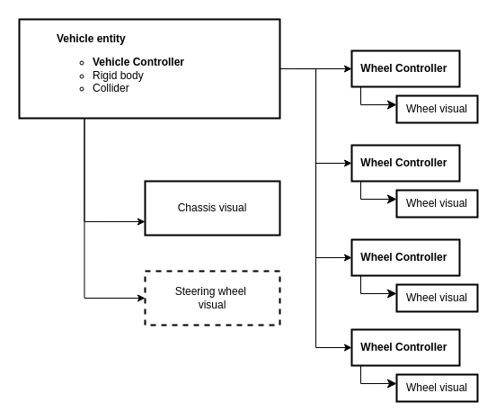
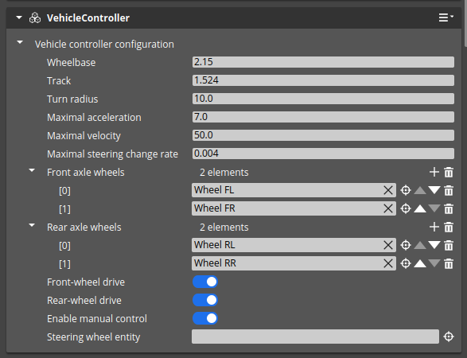
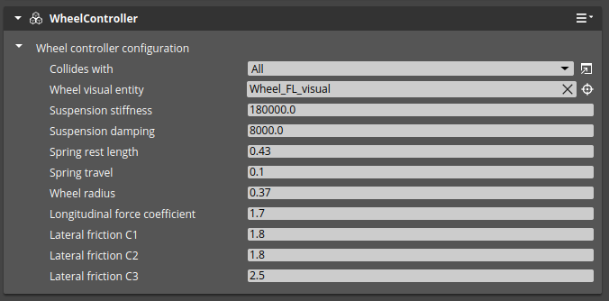
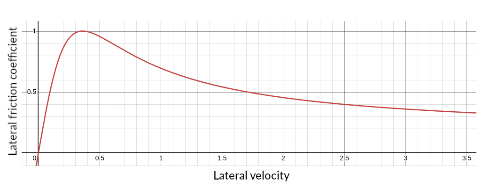

# VehicleDynamics - Model description

## Overview

The vehicle dynamics consists of two components:
- `Vehicle Controller` - component used to control the vehicle model, connects wheel controllers and vehicle physics body
- `Wheel Controller` - component used to control the wheel model, responsible for simulation of:
    - suspension
    - steering
    - lateral and longitudinal forces

The vehicle model can be controlled using 2 parameters: steering angle and acceleration coefficient. These parameters can be set using buses or using keyboard by enabling manual control in the `Vehicle Controller` component.

The complete vehicle asset should consist of:
- Entity with `Rigid Body` - physics body of the vehicle, with mass, inertia, and collision geometry, as well as damping
- Chassis visualization - visual representation of the vehicle. It must be in the same entity, or a child of the rigid body entity.
- `Vehicle Controller` component.
- Four entities with `Wheel Controller` components, children of the rigid body entity.
- Visualization of the wheels, children of the wheel controller entities.
- Optionally, entity with visualization of the steering wheel, child of the rigid body entity.

## Requirements and limitations

Following requirements must be met to use the vehicle dynamics:
- The vehicle chassis must have a rigid body entity with mass and inertia.
- `Vehicle Controller` component must be placed in the same entity as the rigid body.
- Wheels entities (with `Wheel Controller` components) must be children of the rigid body entity and be located in the top-most point of the suspension.
- Collision shape is not necessary, but it is recommended. The collision shape however must not cover the ray-cast line, which starts at wheel entities (with `Wheel Controller` components) and is directed downwards (along Z-axis).
- The model is based on the assumption that the Z-axis is vertical and facing up, and the X-axis is longitudinal and facing forward. Ray-casting is performed in the negative Z direction, wheels rotate around Y-axis. Thus:
    - The main vehicle entity, containing `Rigid Body` and `Vehicle Controller` must be oriented according to this assumption. If needed, chassis visualization may be placed in a separate entity (child of the rigid body entity) and oriented differently than parent entity.
    - Entities with the `Wheel Controller` component must be children to the rigid body entity and oriented in the same way.
    - The wheel visualization entity must be a child of either: the wheel entity or the rigid body entity. It must be oriented so that the Y-axis is the rotation axis. Visualization origin must be placed in the center of the wheel. If needed, entity with wheel mesh may be placed in a separate entity (child of the wheel visualization entity) and oriented differently than parent entity.
- It is advised to keep the origin of the vehicle model at the center of the vehicle, on the ground.
- Wheels must not have rigid bodies.
- Steering wheel visualization entity is optional. It must be a child of the rigid body entity and must be oriented so that the Y-axis is the axis of rotation.
- The vehicle dynamics model can control only 4 wheels on two axles. The front wheels are always steerable. Wheel entities must be ordered from left to right in the `Vehicle Controller` component.

The vehicle model is simplified and does not take into account more advanced physics. In particular:
- Simulation of wheels is based on a single point of contact with the ground. The wheel is assumed to be a point, where forces are applied. Wheel rotation dynamics is not simulated. Thus:
    - Wheel slip in lateral axis is not simulated.
    - Wheel visualization is rotated based on velocity in the contact point. There is no visual slip.
    - Driving torque is not calculated, so driving force is estimated based on the acceleration coefficient.
    - Wheels don't have mass or inertia.
- Engine and transmission are not simulated. The vehicle is controlled by a force derived from acceleration coefficient, and divided into wheels based on the ground force.

## Components

### Vehicle Controller component

#### Description

This component is used to control the vehicle model. It must be placed in the same entity as the vehicle's rigid body.

#### Inputs

- `Acceleration` - acceleration in m/s^2 to be applied to the vehicle
- `Steering angle` - steering angle in degrees

#### Parameters

- `Wheel base` - distance between the front and rear axles of the vehicle in meters
- `Rear track` - distance between the rear wheels of the vehicle in meters
- `Turn radius` - radius of the turn the vehicle is making in meters
- `Maximal acceleration` - maximal acceleration the vehicle can achieve in m/s^2 - input acceleration will be clipped to this value
- `Maximal velocity` - maximal velocity the vehicle can achieve in m/s
- `Maximal steering change rate` - maximal change rate of the steering angle in degrees/s
- `Wheels of the front axle` - list of wheels (entities with `Wheel Controller`) of the front axle, ordered from left to right
- `Wheels of the rear axle` - list of wheels (entities with `Wheel Controller`) of the rear axle, ordered from left to right
- `Front wheels drive` - flag indicating if the front wheels are driving
- `Rear wheels drive` - flag indicating if the rear wheels are driving
- `Enable manual control` - flag indicating if the vehicle can be controlled using the arrow keys of your keyboard
- `Steering wheel entity` - entity with a steering wheel visualization, which will be rotated according to the steering angle

### Wheel Controller component

#### Description

This component should be a child of the vehicle's rigid body entity. It should be located at the position of the upper mounting point of the
suspension.

#### Parameters

- `Wheel visual entity` - entity with a wheel visualization, which will be rotated according to the wheel rotation
- `Suspension stiffness` - stiffness of the suspension
- `Suspension damping` - damping of the suspension
- `Spring rest length` - rest length of the spring in meters
- `Spring travel` - maximum travel of the spring from the rest length in meters
- `Wheel radius` - radius of the wheel in meters
- `Longitudinal force coefficient` - coefficient of the longitudinal force
- `Lateral friction C1` - lateral friction C1 coefficient (see below)
- `Lateral friction C2` - lateral friction C2 coefficient (see below)
- `Lateral friction C3` - lateral friction C3 coefficient (see below)

**Lateral friction**

Lateral wheel force is proportional to:
- Ground force
- Friction coefficient
- Longitudinal velocity (inverse proportionality)

The friction coefficient is calculated based on lateral velocity. The formula is as follows:

**_fc_ = _c1_ * sin(_c2_ * arctan(_c3_ * _v_))**

Where:

- **_fc_** - lateral friction coefficient
- **_v_** - lateral velocity
- **_c1_** - lateral friction C1 coefficient, responsible for coefficient scaling: the higher _c1_ value, the larger lateral force.
- **_c2_** - lateral friction C2 coefficient, indicates how steep the declining part of the curve is: the higher _c2_ value, the lower values of the resultant coefficient in larger velocity. _c2_ should be larger than 1.0.
- **_c3_** - lateral friction C3 coefficient, responsible for velocity scaling: the higher _c3_ value, the faster max value is reached.
