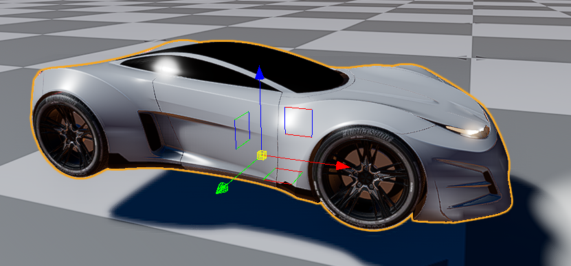
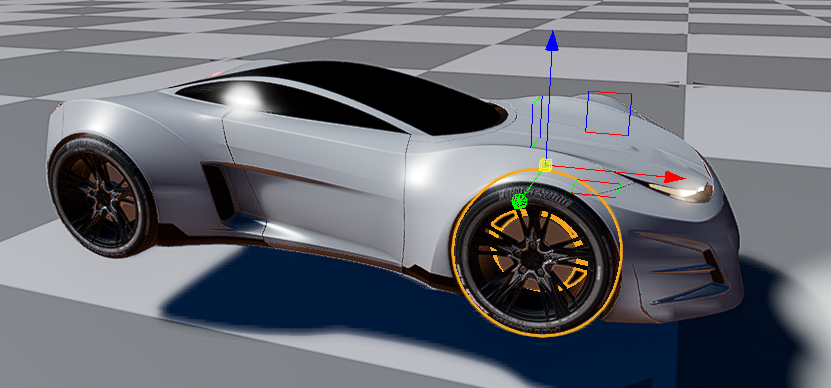
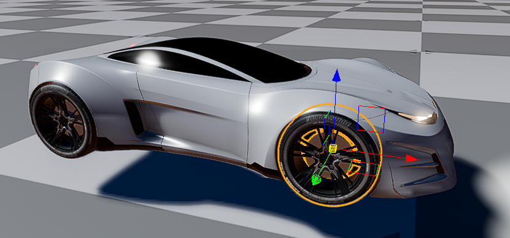
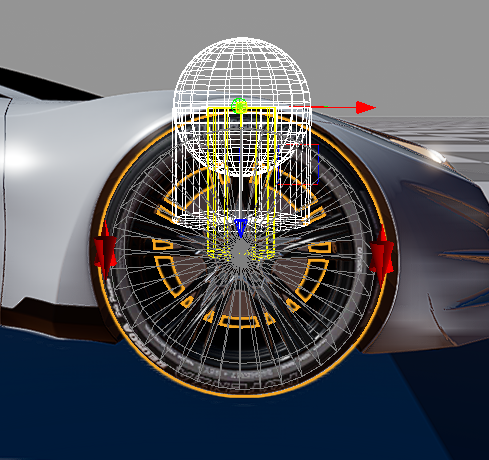

# VehicleDynamics - Model description

What you need:

- O3DE 23.20.3
- Vehicle Dynamics Gem
- Vehicle model with separated wheels, and (optionally) a steering wheel

Follow these steps to create the model:

### Step 1

Create the main structure of entities. It should look similar to this, depending on structure of mesh entities:

```
[Vehicle]
├── [Vehicle visual]
│  └── [Vehicle mesh]
├── [Wheel FL]
│  └── [Wheel FL visual]
│     └── [Wheel FL mesh]
├── [Wheel FR]
│  └── [Wheel FR visual]
│     └── [Wheel FR mesh]
├── [Wheel RL]
│  └── [Wheel RL visual]
│     └── [Wheel RL mesh]
├── [Wheel RR]
│  └── [Wheel RR visual]
│     └── [Wheel RR mesh]
├── [Steering wheel]
│   └── [Steering wheel visual]
```

In this structure, meshes are located in separate entities, which are children of the visual entities. This is not mandatory but will be helpful if you need to adjust the position, rotation, or scale of the meshes. You can also use multiple mesh entities at the same level. This might the the best option if your model is split into more parts, e.g. if the wheel consists of a rim and a tire.

### Step 2

Add visualization meshes to each `mesh` entity (create multiple mesh entities if needed). Add proper transformation. 
Follow these rules:

1. `Vehicle visual` must be oriented with the X-axis pointing in the vehicle's forward direction and the Z-axis pointing up. The entity's origin should be located at the vehicle's center, on the ground plane. The `Vehicle mesh` must be transformed to match these rules.
2. The `Wheel` entities must be placed on the top of the suspension - they represent the mounting point where the spring and dumper are attached to the chassis. The relative (to the parent entity) rotation must be zero, and the scale must be 1.
3. The `Wheel visual` entities must be oriented so that the Y-axis is the rotation axis. To make it simple, set the relative rotation to 0. 
4. The `Wheel visual` entity's origin must be in the center of the wheel to ensure correct rotation. Transform the `Wheel mesh` to match the requirements from this and the previous point. The position of the `Wheel visual` entity is not important, as it is adjusted automatically. Move it to the location where the wheel should be placed for convenience.
5. The `Steering wheel` entity must be oriented so that the Y-axis is the axis of rotation. The origin of this entity must be on the rotation axis.

Origin and orientation of the `Vehicle` entity:



Origin and orientation of the `Wheel FR` entity:



Origin and orientation of the `Wheel FR visual` entity:



### Step 3

Add `Wheel Controller` component for each wheel entity. Set the parameters as follows:

1. Set `Wheel radius` to match the radius of the wheel.
2. Set `Spring rest length` to the distance from the top of the suspension to the center of the wheel. Typically this can be adjusted to match the visual model.
3. Set `Spring travel` according to your needs. This is the maximum distance the wheel can travel up and down.
4. Set `Wheel visual entity` to the entity containing visual.

The wheel component provides a convenient debug visualization, which can help setting these parameters.



The rest of component's parameters should be set experimentally. In the case of a typical sport car, you can use following values as a starting point:


### Step 4

In the `Vehicle` entity:

1. Add `PhysX Dynamic Rigid Body`:
   1. The rigid body should have mass and inertia matching the real vehicle.
   2. Increase `Linear damping` to around `0.12`. This will reflect air drag, rolling resistance, and other damping forces. Tune it according to your needs.
   3. To increase vehicle stability keep the center of mass low. 
2. Add colliders. They should not cover `Wheel` entities and the ray-cast line directed to the ground. Use simple shapes like boxes or capsules if you don't have proper meshes.

### Step 5

Add `Vehicle Controller` component to the `Vehicle` entity:
1. Add `Wheel` entities to the `Wheels` array. Remember to maintain the order of the wheels from left to right. 
2. Set the `Wheelbase` and `Track` parameters to match your model.
3. Set other parameters according to your needs.
4. Turn on `Manual control` if you want to control the vehicle manually.
5. Set `Steering wheel entity` if you have the steering wheel visualization.

The component should look similar to this:


### Step 6

The model is ready. You can now test it in the game mode.
