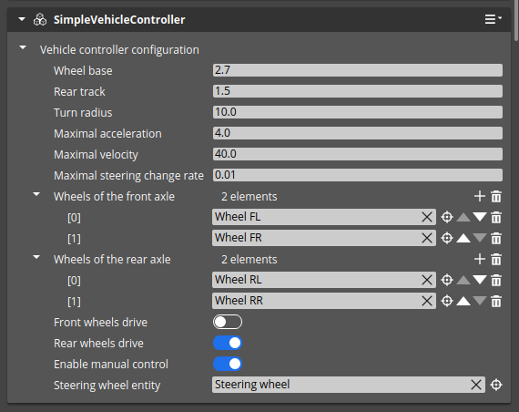
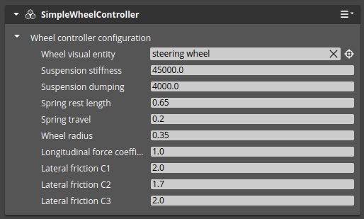

# VehicleDynamics

## Simple Vehicle Dynamics

### Simple Vehicle Controller component

#### Description

This component is used to control the vehicle model. It must be placed in the same entity as the vehicle's rigid body.

#### Inputs

- `Acceleration` - acceleration in m/s^2 to be applied to the vehicle
- `Steering angle` - steering angle in degrees

#### Parameters

- `Wheel base` - distance between the front and rear axles of the vehicle
- `Rear track` - distance between the rear wheels of the vehicle
- `Turn radius` - radius of the turn the vehicle is making
- `Maximal acceleration` - maximal acceleration the vehicle can achieve in m/s^2 - input acceleration will be clipped to this value
- `Maximal velocity` - maximal velocity the vehicle can achieve in m/s
- `Maximal steering change rate` - maximal change rate of the steering angle in degrees/s
- `Wheels of the front axle` - list of wheels (entities with `Simple Wheel Controller`) of the front axle, ordered from left to right
- `Wheels of the rear axle` - list of wheels (entities with `Simple Wheel Controller`) of the rear axle, ordered from left to right
- `Front wheels drive` - flag indicating if the front wheels are driving
- `Rear wheels drive` - flag indicating if the rear wheels are driving
- `Enable manual control` - flag indicating if the vehicle can be controlled using arrow keys
- `Steering wheel entity` - entity with a steering wheel visualization, which will be rotated according to the steering angle

### Simple Wheel Controller component

#### Description

This component should be a child of the vehicle's rigid body entity. It should be located at the position of the upper mounting point of the 
suspension. 

#### Parameters

- `Wheel visual entity` - entity with a wheel visualization, which will be rotated according to the wheel rotation
- `Suspension stiffness` - stiffness of the suspension
- `Suspension damping` - damping of the suspension
- `Spring rest length` - rest length of the spring in meters
- `Spring travel` - maximum travel of the spring from the rest length in meters
- `Wheel radius` - radius of the wheel in meters
- `Longitudinal force coefficient` - coefficient of the longitudinal force
- `Lateral friction C1` - lateral friction C1 coefficient (see below)
- `Lateral friction C2` - lateral friction C2 coefficient (see below)
- `Lateral friction C3` - lateral friction C3 coefficient (see below)

**Lateral friction**

Lateral wheel force is proportional to:

- Ground force
- Friction coefficient
- Longitudinal velocity (inverse proportionality)

The friction coefficient is calculated based on lateral velocity. The formula is as follows:    

**_fc_ = _c1_ * sin(_c2_ * arctan(_c3_ * _v_))**

Where:

- **_fc_** - lateral friction coefficient
- **_v_** - lateral velocity
- **_c1_** - lateral friction C1 coefficient, is responsible for coefficient scaling - the higher _c1_ value, the larger lateral force.
- **_c2_** - lateral friction C2 coefficient, indicates how steep the declining part of the curve is - the higher _c2_ value, the lower values of the resultant coefficient in larger velocity. _c2_ should be larger than 1.0. 
- **_c3_** - lateral friction C3 coefficient, is responsible for velocity scaling - the higher _c3_ value, the faster max value is reached.

