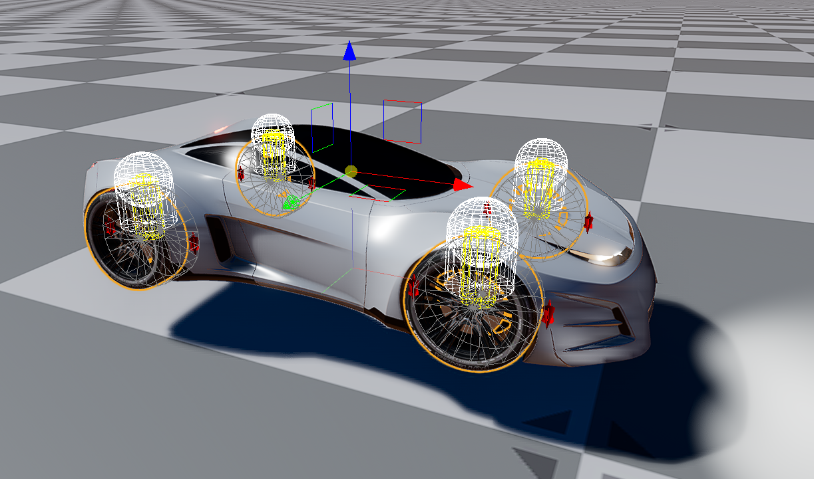
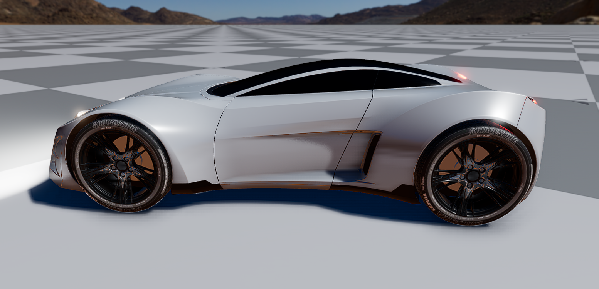

# VehicleDynamics

This gem contains simplified implementation of vehicle dynamics for the [O3DE engine](https://o3de.org). The implementation uses
single-point ray-cast to find the ground contact point and simulate suspension, steering, and wheel forces. Vehicle
movement is achieved by applying longitudinal, lateral and suspension forces to the vehicle's rigid body in the
point of contact with the ground.

## Getting started

### Model Description

If you plan to use this model, be sure to read [Model Description](Docs/Model_description.md) to:
- get familiar with the model structure and functionality,
- see the requirements and limitations of the model,
- learn about components and their parameters.

### Tutorial

You can follow the [Step-by-step tutorial](Docs/Tutorial.md) to learn how to set up the model.

### Example car

The example car prefab is located in the [Assets/ExampleCar](Assets/ExampleCar) folder. It contains a prefab with
ready-to-use car model.

The model of the car is licensed CC0 and was obtained from [this place](https://sketchfab.com/3d-models/free-concept-car-025-public-domain-cc0-e3a65443d3e44c33b594cec591c01c05).